<!-- Generated by scripts/gen-doc-graphs.ts - do not edit by hand.
     Run `pnpm run gen-doc-graphs` to regenerate. -->

# Project Delivery Stage Composition

The project-delivery demo composes one shared spine plus a six-stage preset roster (requirements/design/coding/testing/release/retrospective); a driver creates one agent per stage whose setup hook mounts the stage preset.

```mermaid
flowchart LR
  cfg["examples/project-delivery<br/>cordis.yml"]
  plugin_project_delivery_settings["settings<br/>@deepseek-ai/dsh-settings-file"]
  cfg --> plugin_project_delivery_settings
  plugin_project_delivery_credentials["credentials<br/>@deepseek-ai/dsh-credentials-local"]
  cfg --> plugin_project_delivery_credentials
  plugin_project_delivery_llm_deepseek["llm-deepseek<br/>@deepseek-ai/dsh-llm-deepseek"]
  cfg --> plugin_project_delivery_llm_deepseek
  plugin_project_delivery_subprocess["subprocess<br/>@deepseek-ai/dsh-subprocess-local"]
  cfg --> plugin_project_delivery_subprocess
  plugin_project_delivery_bash["bash<br/>@deepseek-ai/dsh-bash-local"]
  cfg --> plugin_project_delivery_bash
  plugin_project_delivery_pwsh["pwsh<br/>@deepseek-ai/dsh-pwsh-local"]
  cfg --> plugin_project_delivery_pwsh
  plugin_project_delivery_agent_presets["agent-presets<br/>@deepseek-ai/dsh-agent-presets"]
  cfg --> plugin_project_delivery_agent_presets
  plugin_project_delivery_agent_spine["agent-spine<br/>@deepseek-ai/dsh-agent-spine-demo"]
  cfg --> plugin_project_delivery_agent_spine
  plugin_project_delivery_user_questions["user-questions<br/>@deepseek-ai/dsh-user-questions"]
  cfg --> plugin_project_delivery_user_questions
  plugin_project_delivery_persistence["persistence<br/>@deepseek-ai/dsh-session-persistence-jsonl"]
  cfg --> plugin_project_delivery_persistence
  plugin_project_delivery_checkpoint_policy["checkpoint-policy<br/>@deepseek-ai/dsh-session-checkpoint-policy"]
  cfg --> plugin_project_delivery_checkpoint_policy
  plugin_project_delivery_token_meter["token-meter<br/>@deepseek-ai/dsh-token-meter"]
  cfg --> plugin_project_delivery_token_meter
  plugin_project_delivery_compaction_basic["compaction-basic<br/>@deepseek-ai/dsh-compaction-basic"]
  cfg --> plugin_project_delivery_compaction_basic
  plugin_project_delivery_session_projection["session-projection<br/>@deepseek-ai/dsh-session-projection"]
  cfg --> plugin_project_delivery_session_projection
  plugin_project_delivery_subagent["subagent<br/>@deepseek-ai/dsh-subagent"]
  cfg --> plugin_project_delivery_subagent
  plugin_project_delivery_subagent_spawn_in_process["subagent-spawn-in-process<br/>@deepseek-ai/dsh-subagent-spawn-in-process"]
  cfg --> plugin_project_delivery_subagent_spawn_in_process
  plugin_project_delivery_subagent_fork_in_process["subagent-fork-in-process<br/>@deepseek-ai/dsh-subagent-fork-in-process"]
  cfg --> plugin_project_delivery_subagent_fork_in_process
  plugin_project_delivery_fs_local["fs-local<br/>@deepseek-ai/dsh-fs-local"]
  cfg --> plugin_project_delivery_fs_local
  plugin_project_delivery_fs_observation_policy["fs-observation-policy<br/>@deepseek-ai/dsh-fs-observation-policy"]
  cfg --> plugin_project_delivery_fs_observation_policy
  plugin_project_delivery_storage["storage<br/>@deepseek-ai/dsh-storage"]
  cfg --> plugin_project_delivery_storage
  plugin_project_delivery_storage_json["storage-json<br/>@deepseek-ai/dsh-storage-json"]
  cfg --> plugin_project_delivery_storage_json
  plugin_project_delivery_storage_domain["storage-domain<br/>@deepseek-ai/dsh-storage-domain"]
  cfg --> plugin_project_delivery_storage_domain
  plugin_project_delivery_spec_store["spec-store<br/>@deepseek-ai/dsh-spec"]
  cfg --> plugin_project_delivery_spec_store
```

| Plugin id | Package / module |
| --- | --- |
| `settings` | `@deepseek-ai/dsh-settings-file` |
| `credentials` | `@deepseek-ai/dsh-credentials-local` |
| `llm-deepseek` | `@deepseek-ai/dsh-llm-deepseek` |
| `subprocess` | `@deepseek-ai/dsh-subprocess-local` |
| `bash` | `@deepseek-ai/dsh-bash-local` |
| `pwsh` | `@deepseek-ai/dsh-pwsh-local` |
| `agent-presets` | `@deepseek-ai/dsh-agent-presets` |
| `agent-spine` | `@deepseek-ai/dsh-agent-spine-demo` |
| `user-questions` | `@deepseek-ai/dsh-user-questions` |
| `persistence` | `@deepseek-ai/dsh-session-persistence-jsonl` |
| `checkpoint-policy` | `@deepseek-ai/dsh-session-checkpoint-policy` |
| `token-meter` | `@deepseek-ai/dsh-token-meter` |
| `compaction-basic` | `@deepseek-ai/dsh-compaction-basic` |
| `session-projection` | `@deepseek-ai/dsh-session-projection` |
| `subagent` | `@deepseek-ai/dsh-subagent` |
| `subagent-spawn-in-process` | `@deepseek-ai/dsh-subagent-spawn-in-process` |
| `subagent-fork-in-process` | `@deepseek-ai/dsh-subagent-fork-in-process` |
| `fs-local` | `@deepseek-ai/dsh-fs-local` |
| `fs-observation-policy` | `@deepseek-ai/dsh-fs-observation-policy` |
| `storage` | `@deepseek-ai/dsh-storage` |
| `storage-json` | `@deepseek-ai/dsh-storage-json` |
| `storage-domain` | `@deepseek-ai/dsh-storage-domain` |
| `spec-store` | `@deepseek-ai/dsh-spec` |

Source config: [`examples/project-delivery/cordis.yml`](cordis.yml).

Maintenance mode: hybrid: the leaf plugin list is parsed from its `cordis.yml`; app package expansion is curated from package source.
